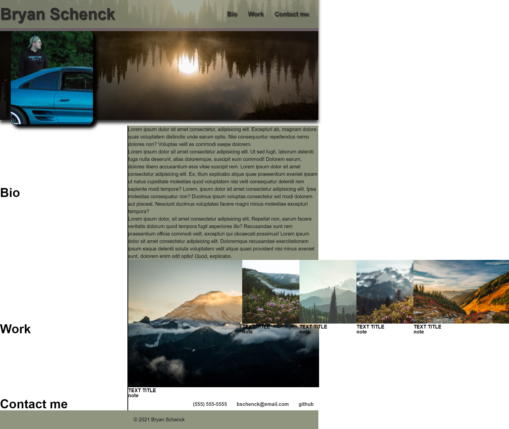

# Project-portfolio-hw2
First attempt at a responsive portfolio webpage. This ended up being way harder than I expected. Ran out of time to get the work cards working.

# Screenshot

[link to deployed webpage](https://brysgithub.github.io/project-portfolio-hw2/)